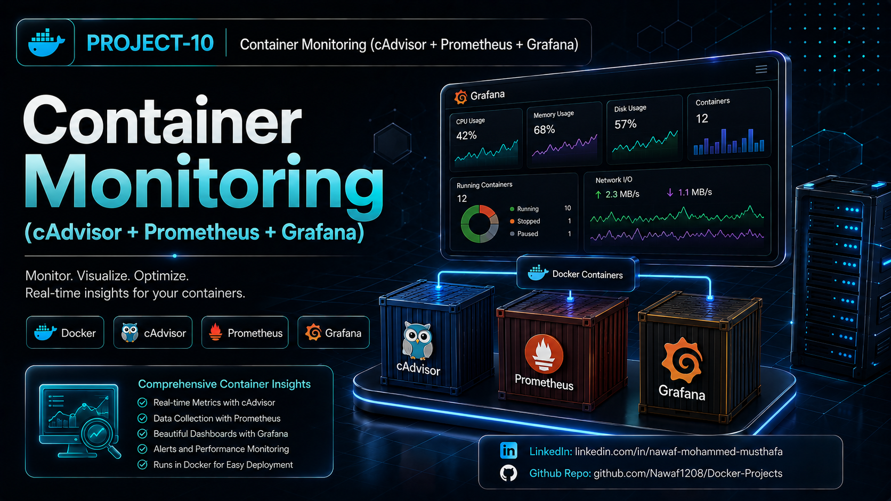
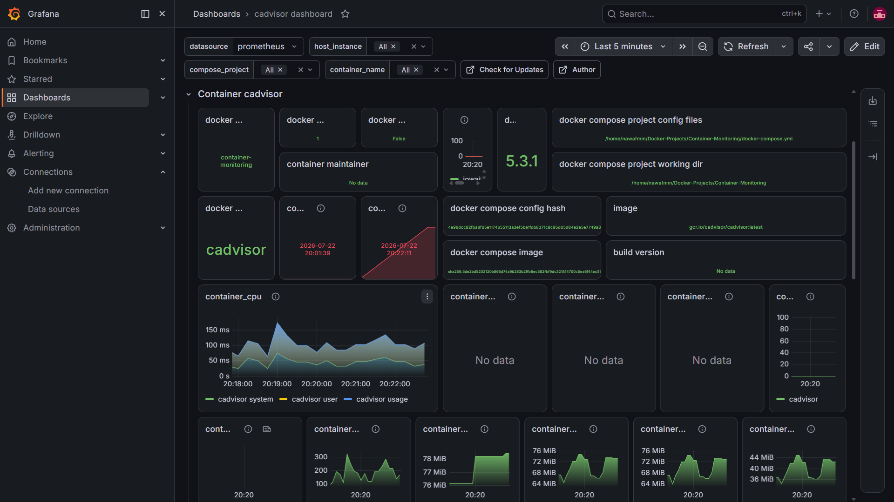
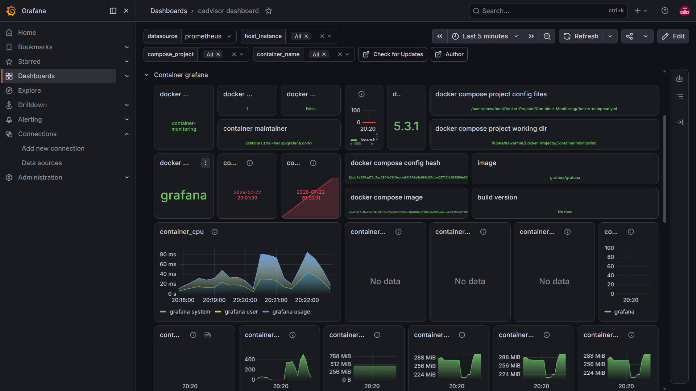
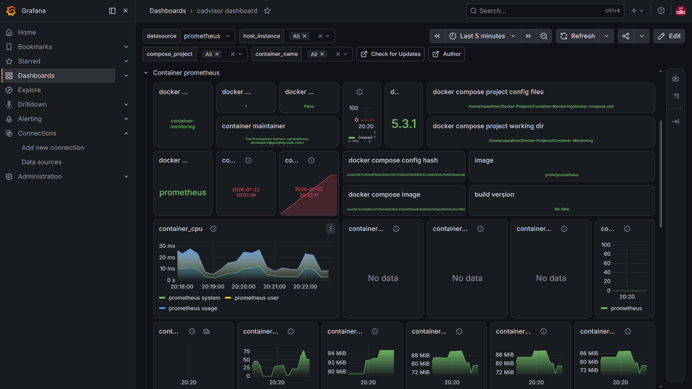

# Container Monitoring (cAdvisor + Prometheus + Grafana)




A complete **container monitoring stack** built using **cAdvisor**, **Prometheus**, and **Grafana** with **Docker Compose**. cAdvisor collects real-time container metrics, Prometheus scrapes and stores the metrics, and Grafana visualizes them through interactive dashboards. This project demonstrates monitoring, metrics collection, dashboard provisioning, and multi-container orchestration.

## Project Features

- **Container Monitoring**: Monitor CPU, memory, filesystem, and network usage of Docker containers.
- **cAdvisor**: Collects real-time container metrics from the Docker host.
- **Prometheus**: Scrapes and stores metrics from cAdvisor.
- **Grafana Dashboards**: Visualizes metrics using interactive dashboards.
- **Automatic Provisioning**: Prometheus datasource and dashboards are configured automatically.
- **Docker Compose**: Deploys the complete monitoring stack with a single command.
- **Persistent Storage**: Grafana data is stored using Docker volumes.

## Project Structure

- **docker-compose.yml**: Defines the cAdvisor, Prometheus, and Grafana services.
- **prometheus/prometheus.yml**: Prometheus scrape configuration.
- **grafana/dashboards/cadvisor-dashboard.json**: Grafana dashboard configuration.
- **grafana/provisioning/dashboards/dashboard.yml**: Dashboard provisioning configuration.
- **grafana/provisioning/datasources/prometheus.yml**: Prometheus datasource provisioning.
- **Project-10.png**: Project banner for GitHub and LinkedIn.
- **README.md**: Project documentation.

## Getting Started

### Prerequisites

- Docker
- Docker Compose

### Installation

1. Navigate to the project directory:

   ```bash
   cd Docker-Projects/Container-Monitoring
   ```

2. Start the monitoring stack:

   ```bash
   docker compose up -d
   ```

## Usage

1. Verify the running containers:

   ```bash
   docker compose ps
   ```

2. Open cAdvisor:

   ```
   http://localhost:8080
   ```

3. Open Prometheus:

   ```
   http://localhost:9090
   ```

4. Open Grafana:

   ```
   http://localhost:3000
   ```

5. Login to Grafana:

   ```
   Username: admin
   Password: admin
   ```

## Verification

1. **Verify running containers:**

   ```bash
   docker compose ps
   ```

2. **View service logs:**

   ```bash
   docker compose logs
   ```

3. **Verify Prometheus targets:**

   Open:

   ```
   http://localhost:9090/targets
   ```

   Ensure the **cadvisor** target is in the **UP** state.

4. **Verify Grafana dashboard:**

   Open:

   ```
   http://localhost:3000
   ```

   Confirm the dashboard displays container CPU, memory, network, and filesystem metrics.

## Dashboard Preview

### cAdvisor Container Metrics



Monitor CPU, memory, filesystem, and network metrics collected directly from Docker containers using cAdvisor.

---

### Grafana Container Metrics



Visualize real-time performance metrics for the Grafana container, including resource usage and health.

---

### Prometheus Container Metrics



Track Prometheus resource consumption and verify successful metric collection from monitored containers.

## Cleanup

Stop and remove the monitoring stack:

```bash
docker compose down
```

Remove the Grafana persistent volume:

```bash
docker volume rm container-monitoring_grafana-data
```