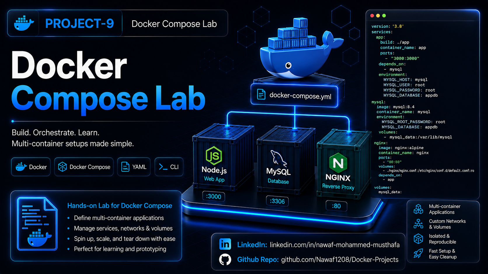

# Docker Compose Lab




A simple **Docker Compose** project that demonstrates how to orchestrate a multi-container application using **Node.js**, **Express**, **MySQL**, and **Nginx**. The application exposes a REST API for managing posts, automatically creates the database table on startup, and uses Nginx as a reverse proxy to forward incoming HTTP requests to the backend service.

## Project Features

- **Docker Compose**: Manages multiple containers with a single command.
- **Express REST API**: Provides endpoints for creating and retrieving posts.
- **MySQL Database**: Stores post data in a relational database.
- **Automatic Database Initialization**: Creates the `posts` table during startup if it doesn't exist.
- **Connection Retry Logic**: Waits for MySQL to become available before connecting.
- **Nginx Reverse Proxy**: Routes incoming requests to the Express application.
- **Container Networking**: Services communicate using Docker's internal network.
- **Environment Variables**: Keeps database configuration separate from the application code.

## Project Structure

- **app/app.js**: Express application and REST API.
- **app/package.json**: Project metadata and npm configuration.
- **app/Dockerfile**: Builds the Node.js application image.
- **app/.dockerignore**: Excludes unnecessary files during image build.
- **docker-compose.yml**: Defines the Express, MySQL, and Nginx services.
- **nginx/nginx.conf**: Nginx reverse proxy configuration.
- **Project-9.png**: Project banner for GitHub and LinkedIn.
- **README.md**: Project documentation.

## Getting Started

### Prerequisites

- Docker
- Docker Compose
- Node.js
- npm

### Installation

1. Navigate to the project directory:

   ```bash
   cd Docker-Projects/Docker-Compose-Lab
   ```

2. Build the containers:

   ```bash
   docker compose build
   ```

## Usage

1. Start the application:

   ```bash
   docker compose up
   ```

2. Verify the containers are running:

   ```bash
   docker compose ps
   ```

3. Access the application:

   ```bash
   curl http://localhost
   ```

   Or open:

   ```
   http://localhost
   ```

4. Retrieve all posts:

   ```bash
   curl http://localhost/posts
   ```

5. Create a new post:

   ```bash
   curl -X POST http://localhost/posts \
   -H "Content-Type: application/json" \
   -d '{
     "title":"Docker Compose",
     "content":"Learning Docker Compose"
   }'
   ```

## Verification

1. **View running containers:**

   ```bash
   docker compose ps
   ```

2. **View application logs:**

   ```bash
   docker compose logs
   ```

3. **Verify the application:**

   ```bash
   curl http://localhost
   ```

4. **Retrieve all posts:**

   ```bash
   curl http://localhost/posts
   ```

## Cleanup

Stop and remove the containers:

```bash
docker compose down
```

Remove the project image:

```bash
docker image rm docker-compose-lab-app
```