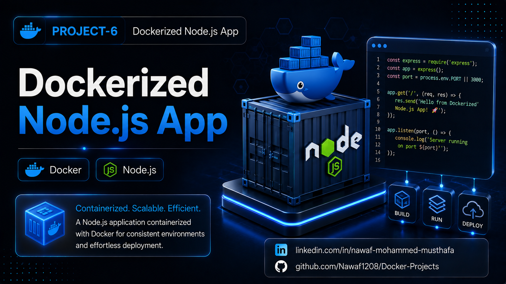

# Dockerized Node.js App




A simple Node.js application containerized with Docker to demonstrate the fundamentals of building, packaging, and running applications inside containers. This project covers Docker images, containers, networking, and basic container lifecycle management.

## Project Features

- **Lightweight HTTP Server**: Built using Node.js's built-in `http` module.
- **Dockerized Application**: Runs the application inside a Docker container.
- **Custom Docker Image**: Builds a reusable Docker image using a Dockerfile.
- **Port Mapping**: Exposes the application on port `3000`.
- **Container Management**: Demonstrates building, running, stopping, and removing containers.

## Project Structure

- **app.js**: Main Node.js application.
- **package.json**: Project metadata and npm configuration.
- **Dockerfile**: Defines how the Docker image is built.
- **.dockerignore**: Excludes unnecessary files from the Docker build context.
- **Project-6.png**: Project banner for GitHub and LinkedIn.
- **README.md**: Project documentation.

## Getting Started

### Prerequisites

- Docker
- Node.js
- npm

### Installation

1. Navigate to the project directory:

   ```bash
   cd Docker-Projects/Dockerized-NodeJS-App
   ```

2. Build the Docker image:

   ```bash
   docker build -t dockerized-nodejs-app .
   ```

## Usage

1. Run the Docker container:

   ```bash
   docker run -d --name dockerized-nodejs-app -p 3000:3000 dockerized-nodejs-app
   ```

2. Verify the container is running:

   ```bash
   docker ps
   ```

3. Access the application:

   ```bash
   curl http://localhost:3000
   ```

   Or open:

   ```
   http://localhost:3000
   ```

## Verification

1. **View available Docker images:**

   ```bash
   docker images
   ```

2. **View running containers:**

   ```bash
   docker ps
   ```

3. **View application logs:**

   ```bash
   docker logs dockerized-nodejs-app
   ```

4. **Verify the application response:**

   ```bash
   curl http://localhost:3000
   ```

## Cleanup

Stop the container:

```bash
docker stop dockerized-nodejs-app
```

Remove the container:

```bash
docker rm dockerized-nodejs-app
```

Remove the Docker image:

```bash
docker rmi dockerized-nodejs-app
```