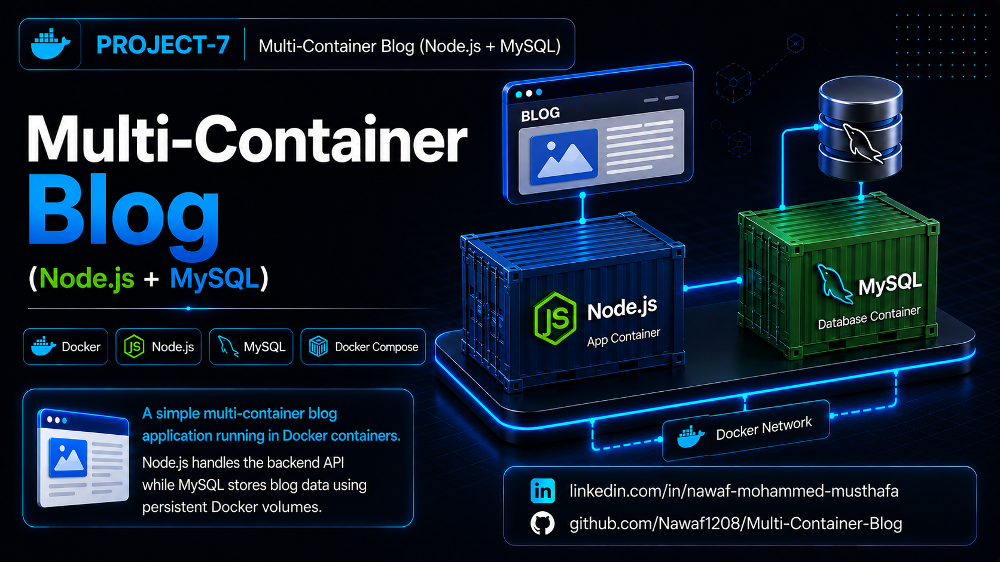

# Multi-Container Blog (Node.js + MySQL)




A simple multi-container blog application built with **Node.js**, **Express**, **MySQL**, and **Docker Compose**. This project demonstrates how multiple containers communicate over a Docker network while using Docker volumes for persistent database storage.

## Project Features

- **REST API**: Create and retrieve blog posts.
- **Multi-Container Architecture**: Separate containers for the application and database.
- **Docker Compose**: Manages multiple containers with a single command.
- **Persistent Storage**: Stores MySQL data using Docker volumes.
- **Automatic Database Setup**: Creates the database table on startup.
- **Database Retry Logic**: Automatically reconnects if MySQL is still initializing.

## Project Structure

- **app.js**: Main Express application.
- **package.json**: Project metadata and npm configuration.
- **package-lock.json**: Dependency lock file.
- **Dockerfile**: Builds the Node.js application image.
- **docker-compose.yml**: Defines the application and MySQL services.
- **.dockerignore**: Excludes unnecessary files from the Docker build context.
- **Project-7.png**: Project banner for GitHub and LinkedIn.
- **README.md**: Project documentation.

## Getting Started

### Prerequisites

- Docker
- Docker Compose

### Installation

1. Navigate to the project directory:

   ```bash
   cd Docker-Projects/Multi-Container-Blog
   ```

2. Build the application:

   ```bash
   docker compose build
   ```

## Usage

1. Start the containers:

   ```bash
   docker compose up
   ```

2. Verify the containers are running:

   ```bash
   docker ps
   ```

3. View all blog posts:

   ```bash
   curl http://localhost:3000/posts
   ```

4. Create a new blog post:

   ```bash
   curl -X POST http://localhost:3000/posts \
   -H "Content-Type: application/json" \
   -d '{"title":"Docker","content":"My first blog"}'
   ```

## Verification

1. **View running containers:**

   ```bash
   docker ps
   ```

2. **View application logs:**

   ```bash
   docker compose logs
   ```

3. **Retrieve all posts:**

   ```bash
   curl http://localhost:3000/posts
   ```

4. **Verify Docker volumes:**

   ```bash
   docker volume ls
   ```

## Cleanup

Stop the containers:

```bash
docker compose down
```

Stop the containers and remove the volume:

```bash
docker compose down -v
```