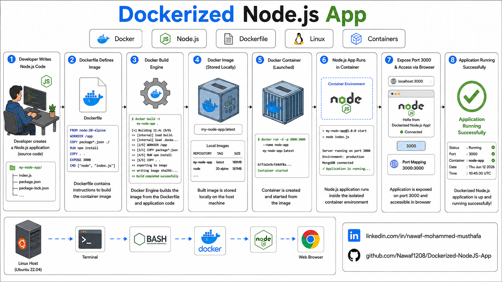
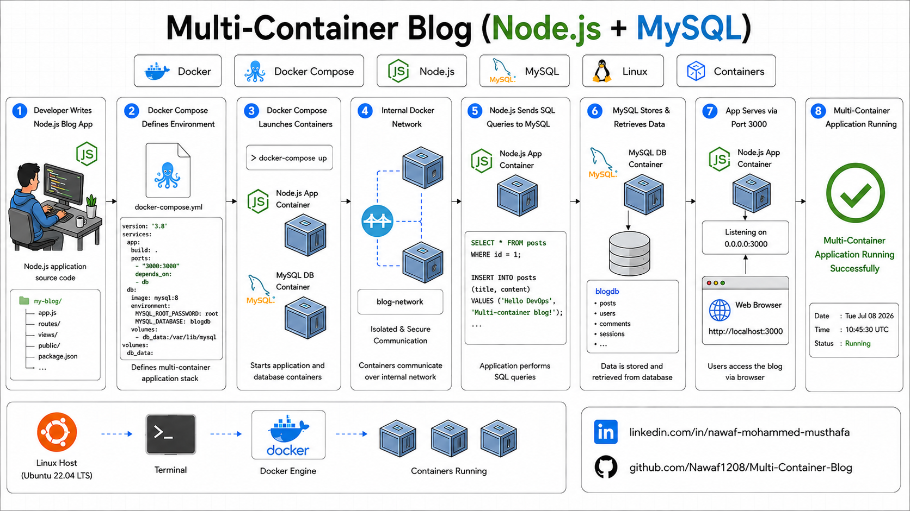
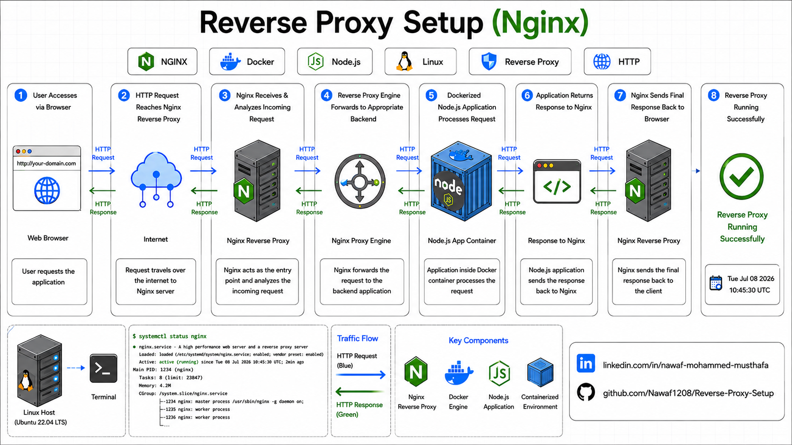
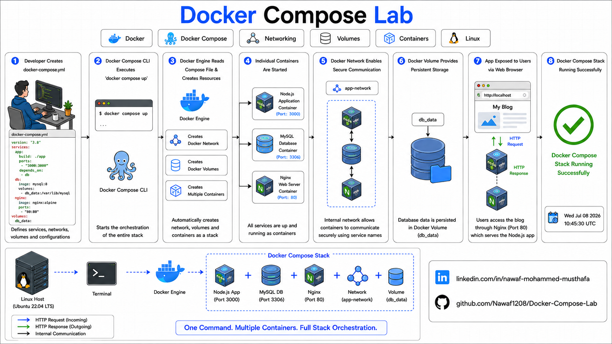
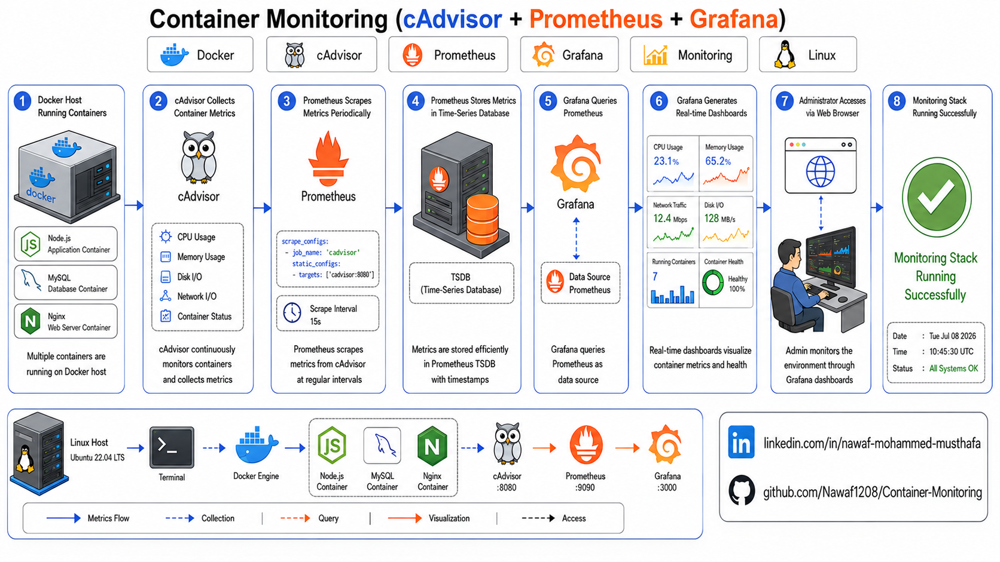

# Docker Projects

A collection of hands-on Docker projects built while learning containerization and Docker fundamentals for DevOps. Each project focuses on practical concepts such as image creation, multi-container applications, networking, reverse proxy, orchestration with Docker Compose, and container monitoring using industry-standard tools.

---

## Projects

### 1. Dockerized Node.js App

A simple Node.js application containerized using Docker to demonstrate image creation, container execution, port mapping, and Dockerfile best practices.

**Project Repository**

🔗 <https://github.com/Nawaf1208/Dockerized-NodeJS-App>

**Key Features**

- Dockerfile
- Custom Docker Image
- Containerized Node.js Application
- Port Mapping
- Lightweight Base Image

---

### 2. Multi-Container Blog

A multi-container blog application using Docker Compose with Node.js and MySQL to demonstrate service orchestration, container networking, and persistent data storage.

**Project Repository**

🔗 <https://github.com/Nawaf1208/Multi-Container-Blog>

**Key Features**

- Multi-Container Application
- Docker Compose
- MySQL Integration
- Service Networking
- Persistent Storage

---

### 3. Reverse Proxy Setup (Nginx)

A reverse proxy configuration using Nginx and Docker Compose to route incoming HTTP requests to backend services.

**Project Repository**

🔗 <https://github.com/Nawaf1208/Reverse-Proxy-Setup>

**Key Features**

- Nginx Reverse Proxy
- Docker Networking
- Request Forwarding
- Header Forwarding
- Single Entry Point

---

### 4. Docker Compose Lab

A complete CRUD application built with Node.js, MySQL, and Nginx using Docker Compose to demonstrate multi-container application development.

**Project Repository**

🔗 <https://github.com/Nawaf1208/Docker-Compose-Lab>

**Key Features**

- Docker Compose
- CRUD REST API
- MySQL Database
- Nginx Reverse Proxy
- Multi-Container Architecture

---

### 5. Container Monitoring (cAdvisor + Prometheus + Grafana)

A complete monitoring stack that collects, stores, and visualizes Docker container metrics using cAdvisor, Prometheus, and Grafana.

**Project Repository**

🔗 <https://github.com/Nawaf1208/Container-Monitoring>

**Key Features**

- Container Monitoring
- cAdvisor Metrics Collection
- Prometheus Monitoring
- Grafana Dashboards
- Automatic Dashboard Provisioning

---
