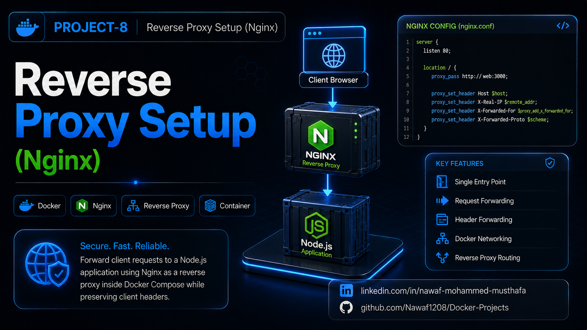

# Reverse Proxy Setup (Nginx)




A simple reverse proxy setup using **Nginx** and **Docker Compose**. Nginx acts as the entry point and forwards incoming HTTP requests to a Node.js application running in a separate container. This project demonstrates reverse proxying, Docker networking, and HTTP header forwarding.

## Project Features

- **Nginx Reverse Proxy**: Routes incoming requests to the backend service.
- **Docker Compose**: Runs multiple containers with a single command.
- **Container Networking**: Containers communicate over Docker's internal network.
- **Header Forwarding**: Preserves client request information using proxy headers.
- **Single Entry Point**: Exposes only the Nginx container to clients.

## Project Structure

- **app.js**: Node.js backend application.
- **package.json**: Project metadata and npm configuration.
- **Dockerfile**: Builds the Node.js application image.
- **docker-compose.yml**: Defines the Node.js and Nginx services.
- **nginx/nginx.conf**: Nginx reverse proxy configuration.
- **.dockerignore**: Excludes unnecessary files during image build.
- **Project-8.png**: Project banner for GitHub and LinkedIn.
- **README.md**: Project documentation.

## Getting Started

### Prerequisites

- Docker
- Docker Compose
- Node.js
- npm

### Installation

1. Navigate to the project directory:

   ```bash
   cd Docker-Projects/Reverse-Proxy-Setup
   ```

2. Build the containers:

   ```bash
   docker compose build
   ```

## Usage

1. Start the application:

   ```bash
   docker compose up
   ```

2. Verify the containers are running:

   ```bash
   docker compose ps
   ```

3. Access the application:

   ```bash
   curl http://localhost
   ```

   Or open:

   ```
   http://localhost
   ```

## Verification

1. **View running containers:**

   ```bash
   docker compose ps
   ```

2. **View application logs:**

   ```bash
   docker compose logs
   ```

3. **Verify the reverse proxy:**

   ```bash
   curl http://localhost
   ```

4. **Inspect forwarded headers:**

   ```bash
   curl http://localhost
   ```

## Cleanup

Stop and remove the containers:

```bash
docker compose down
```

Remove the project image:

```bash
docker image rm reverse-proxy-setup-web
```